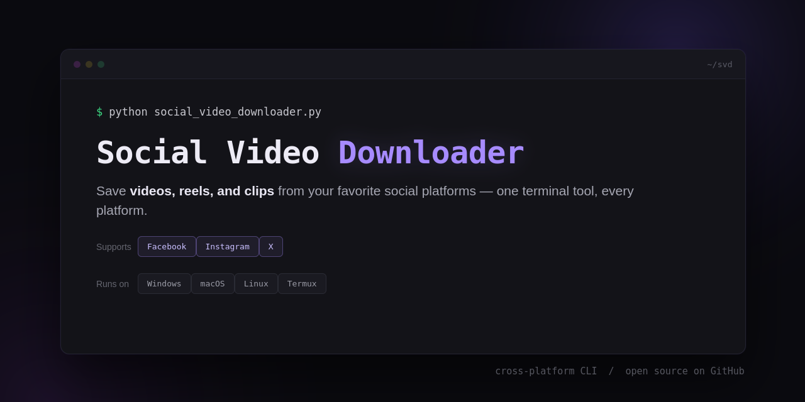

# 🟣 Social Video Downloader

A cross-platform command-line tool for saving videos, reels, and clips from your favorite social platforms — powered by [yt-dlp](https://github.com/yt-dlp/yt-dlp). One tool, every platform.

## 🌍 Supported platforms

| Platform  | Content |
|-----------|---------|
| Facebook  | Public videos and reels |
| Instagram | Posts, reels, and stories |
| X (Twitter) | Video tweets and clips |

## 🖥️ Supported systems

Windows • macOS • Linux • Termux (Android)

## ✨ Features

- 🌐 **Multi-platform in one tool** — no need for a separate downloader per site.
- 🎯 **Best-quality downloads** — automatically grabs the highest quality yt-dlp can find for each link.
- 🎵 **Audio-only mode** — extract MP3 audio instead of video.
- 🔀 **Automatic merging** — video and audio streams are combined via ffmpeg when a platform serves them separately.
- 📊 **Live progress** — percentage, speed, and ETA while downloading.
- 📁 **Smart save location** — auto-detects the right downloads folder per platform (`~/Downloads/SVD` on desktop, Termux shared storage on Android).
- 🖥️ **Windows-safe colors** — ANSI colors enabled natively on Windows terminals, with a plain-text fallback if colors aren't supported.

## 📋 Requirements

- Python 3.9+
- [ffmpeg](https://ffmpeg.org/) (for merging/audio extraction)
- [yt-dlp](https://github.com/yt-dlp/yt-dlp)
- Termux edition only: the [Termux](https://termux.dev/) app on Android

## 🚀 Installation

### Desktop (Windows / macOS / Linux)

```bash
pip install --upgrade yt-dlp

# ffmpeg:
#   Windows : winget install ffmpeg      (or: choco install ffmpeg)
#   macOS   : brew install ffmpeg
#   Linux   : sudo apt install ffmpeg    (or your distro's package manager)

git clone https://github.com/xauusd25/Social_Video_Downloader.git
cd Social_Video_Downloader
python main.py
```

### Termux (Android)

```bash
termux-setup-storage
curl -sS https://raw.githubusercontent.com/xauusd25/Social_Video_Downloader/main/installer.sh | bash

```

## ▶️ Usage

1. Run the script.
2. Paste a Facebook, Instagram, or X video/post URL when prompted.
3. Choose video or audio-only.
4. Watch the live progress bar — your file lands in your downloads folder.
5. Choose to download another link or exit.

> Some Instagram and X content is only visible while logged in. For private or login-walled posts, Our platform supports **cookies**..! — If you export your browser cookies & put it to a file with the name of **cookies.txt** & put that file next to the script, it'll pick up the cookies automatically & you are Done ✅

## ⚠️ Disclaimer

Social Video Downloader is a personal-use tool built on top of yt-dlp. Only download content you have the right to download — your own posts, content licensed for reuse, or personal/offline use where permitted by law. Respect each platform's Terms of Service and copyright law in your country. The maintainers are not responsible for misuse.

## 🙏 Credits

- [yt-dlp](https://github.com/yt-dlp/yt-dlp) — the download engine this tool wraps
- [ffmpeg](https://ffmpeg.org/) — audio/video processing and merging

## 📄 License

This project is licensed under the [MIT License](LICENSE).
